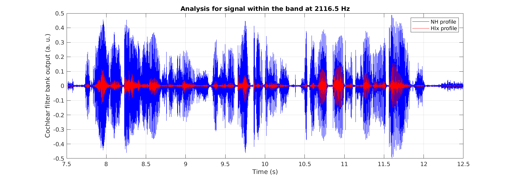

## MATLAB demonstration for VCCA2024

In this demonstration, an auditory model (routine ``relanoiborra2019_featureextraction``) available as part of the [Auditory Modelling Toolbox](https://www.amtoolbox.org/) (AMT) will be used to illustrate the effects of sound processing at the level of the cochlea for (simulated) normal-hearing and hearing-impaired listening.

More specifically, the sound ``scribe_male_talker.wav`` (file in this repository, directory ``open_source_auditory_models/Python/ICNet/``) will be used. The functional approximations of the initial parts of the auditory processing up to the cochlea will be illustrated, i.e., the sound will be subjected to the outer-ear and middle-ear modules and to the cochlear filter bank, before the inner-hair-cell envelope extraction. The selected model uses an implementation of the dual resonance non-linear (DRNL) developed by Ray Meddis and Enrique López-Poveda in the late 90's and early 2000's. In this demo we will show the effects of a non-linear (healthy) cochlea and that of a damaged cochlea that results in linear input-output functions.

The required processing and generated figures are coded in the script ``VCCA_demo_MATLAB.m``, which will run without any specific input or output setting. Optionally, to listen to the resulting sounds and store the results on disk, type ``help VCCA_demo_MATLAB.m`` and follow the instructions.

For the first band just above 2000 Hz, the cochlear filter bank outputs for a normal-hearing and hearing-impaired cochlea using ``relanoiborra2019_featureextraction.m`` is:

Resulting waveforms when processing ``scribe_male_talker.wav``.|  
:-------------------------:|
   

# References
**Lopez-Poveda2001**: Lopez-Poveda, E., & Meddis, R. (2001). A human nonlinear cochlear filterbank. J. Acoust. Soc. Am., 110(6), 3107–3118. doi:[10.1121/1.1416197](https://doi.org/10.1121/1.1416197)

**Majdak2022**: Majdak, P., Hollomey, C., & Baumgartner, R. (2022). AMT 1.x: A toolbox for reproducible research in auditory modeling. Acta Acustica, 6, 19. doi:[10.1051/aacus/2022011](https://doi.org/10.1051/aacus/2022011)

**Relaño-Iborra2019**: Relaño-Iborra, H., Zaar, J., & Dau, T. (2019). A speech-based computational auditory signal processing and perception model. J. Acoust. Soc. Am., 146(5), 3306–3317. doi:[10.1121/1.5129114](https://doi.org/10.1121/1.5129114)
