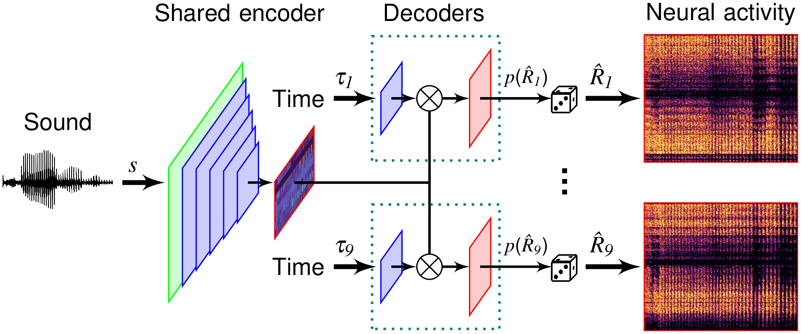

## ICNet: A deep neural network model of central auditory processing

This repository contains the source code of the ICNet model and an example Jupyter notebook `ICNet_example.ipynb` that can be used to simulate neural activity in the inferior colliculus (IC) in response to a sound stimulus. A Google Colab version of the notebook can also be found [here](https://colab.research.google.com/drive/1tUw2u55TCYLq7qGxfzPOr611fAdCH4UU) and can be executed without a local Python installation. The supporting work can be found on [bioRxiv](https://doi.org/10.1101/2024.06.17.599294) and can be cited as follows:
> Drakopoulos, F., Sabesan, S., Xia, Y., Fragner, A. & Lesica, N. A. (2024). Modeling neural coding in the auditory brain with high resolution and accuracy. bioRxiv 2024.06.17.599294; doi: [10.1101/2024.06.17.599294](https://doi.org/10.1101/2024.06.17.599294)

The *DNN* folder contains the deep-neural-network (DNN) architecture, weights and configuration parameters of the pre-trained ICNet model. The *src* folder contains all the supplementary Python functions to execute ICNet. This repository also contains an example sound file `scribe_male_talker.wav` from the [UCL SCRIBE dataset](http://www.phon.ucl.ac.uk/resource/scribe), a pre-compiled Python version of the provided Jupyter notebook `ICNet_example.py`, this `README.MD` document and a license file. 

ICNet was developed to describe the shared sound encoding across a set of 9 normal-hearing gerbils. The `output_to_simulate` variable in the example notebook can be adjusted to simulate neural activity of individual animals (e.g. `output_to_simulate='animal_random'` for a random animal), to generate neural responses using units from all 9 animals (e.g. `output_to_simulate='units_1000'` for 1000 neural units selected from all animals with logarithmic spacing of CFs along the IC), or to derive the response of the shared bottleneck layer for use as a front-end (`output_to_simulate='bottleneck'`). The characteristic frequencies (CFs) of all neural units are included in the *DNN* folder to simulate neural responses that reflect the tonotopic organization of the IC.

<p align="left">
    
</p>


## How to execute the ICNet model

To run the example Jupyter notebook and the ICNet model, it is necessary to install the Python packages included in `requirements.txt`. We recommend installing [conda](https://www.anaconda.com/download) and executing the following commands:

```
conda create --name ICNet python=3.11
conda activate ICNet
pip install -r requirements.txt
```

The first two commands are used to create (and activate) a new conda environment named `ICNet` with Python v3.11. If using only Python (without conda), running the last command is sufficient to install all necessary packages.

----

## Citation
If you use this code, please cite the corresponding paper or this repository:

Drakopoulos, F., Fragner, A. & Lesica, N. A. (2024). ICNet: A DNN model of central auditory processing (v1.0). Zenodo. [https://zenodo.org/doi/10.5281/zenodo.11842064](https://zenodo.org/doi/10.5281/zenodo.11842064).

[](https://zenodo.org/doi/10.5281/zenodo.11842064)

##
For questions, please reach out to one of the corresponding authors:

* Fotios Drakopoulos: f.drakopoulos@ucl.ac.uk
* Nicholas A Lesica: n.lesica@ucl.ac.uk

> This work was supported by EPSRC EP/W004275/1 and MRC MR/W019787/1.
